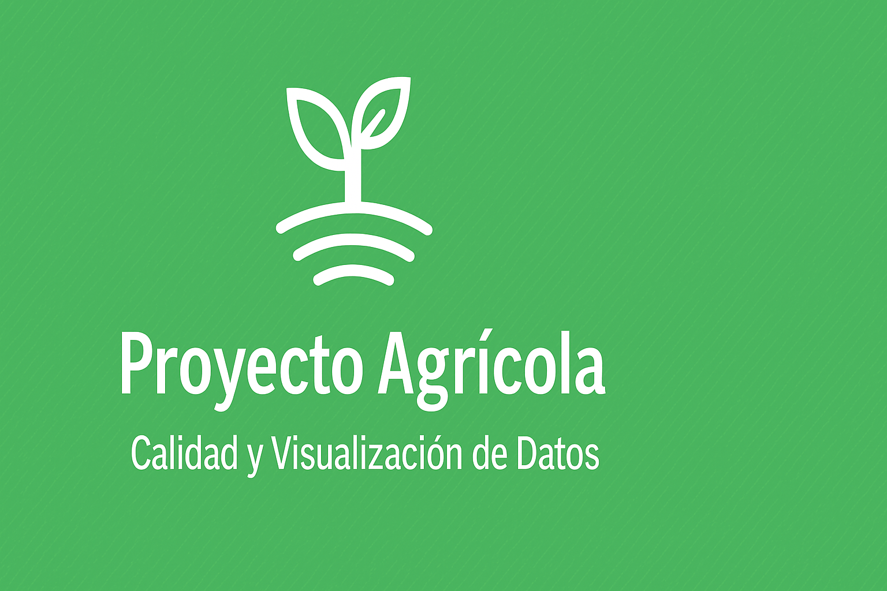
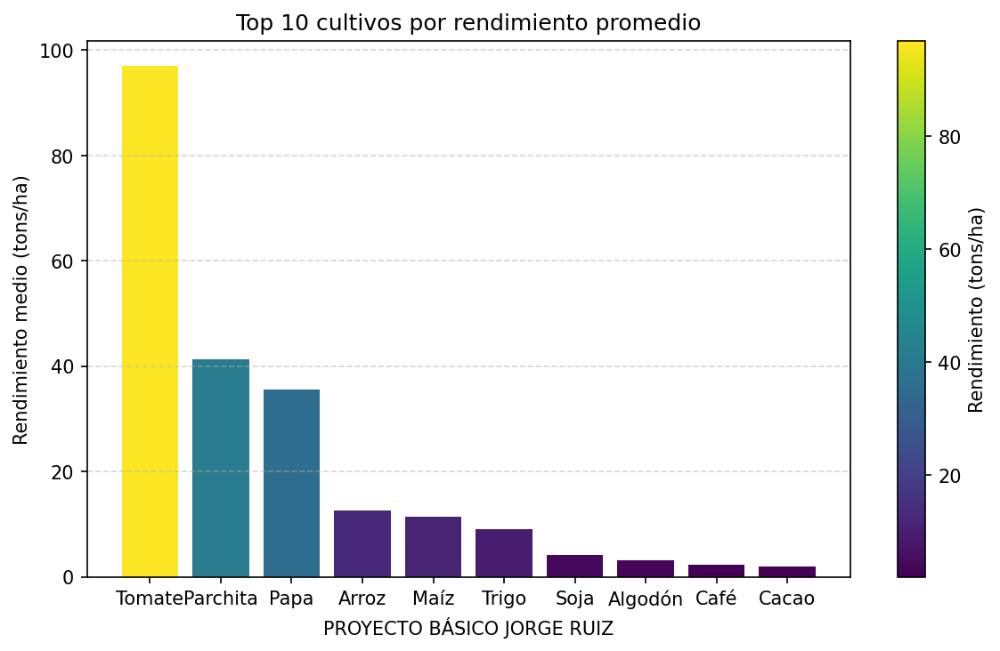
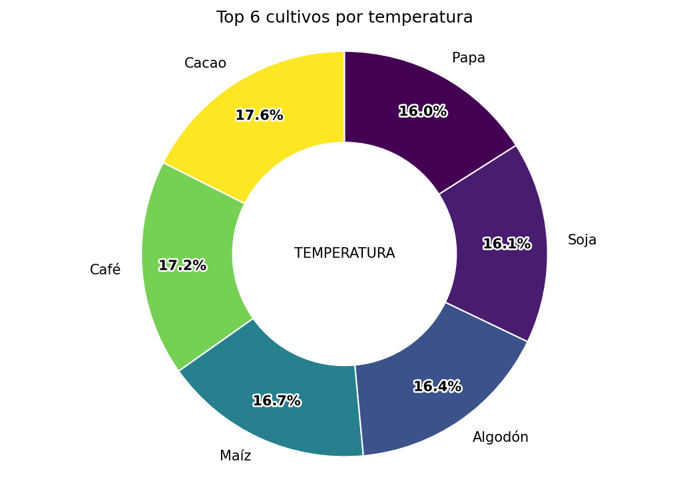
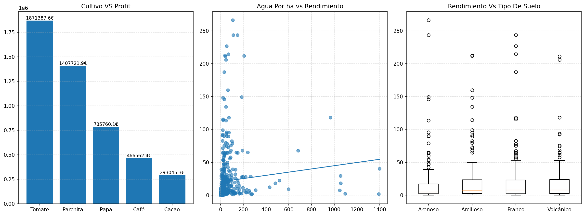

<p align="center">
  
</p>

<h1 align="center">🌱 Proyecto Agrícola — Calidad y Visualización de Datos</h1>
<p align="center">
  <i>EDA, control de calidad y visualización de un dataset agrícola.</i>
</p>

<p align="center">
  <!-- Badges con enlaces oficiales -->
  <a href="https://www.python.org/">
    
  </a>
  <a href="https://pandas.pydata.org/">
    
  </a>
  <a href="https://matplotlib.org/">
    
  </a>
  <a href="LICENSE">
    
  </a>

  <!-- Badges del repo -->
  <a href="https://github.com/milinagi/proyecto-agricola/commits">
    
  </a>
  <a href="https://github.com/milinagi/proyecto-agricola">
    
  </a>
</p>


<p align="center">
  <a href="#demo-rapida">Demo</a> ·
  <a href="#caracteristicas">Características</a> ·
  <a href="#estructura-del-proyecto">Estructura</a> ·
  <a href="#instalacion">Instalación</a> ·
  <a href="#uso">Uso</a> ·
  <a href="#resultados">Resultados</a> ·
  <a href="#metodologia">Metodología</a> ·
  <a href="#faq">FAQ</a> ·
  <a href="#licencia">Licencia</a>
</p>

---

## 🚀 Demo rápida

```bash
python -m venv .venv
# Windows
.\.venv\Scripts\activate
# macOS / Linux
# source .venv/bin/activate

pip install -r requirements.txt
python main.py
```

## ✨ Características

- **Perfilado de calidad:** tamaño, `info()`, `describe()`, **nulos**, **duplicados**.
- **Detección de outliers (IQR)** en todas las numéricas.
- **Validación de rangos** (temperatura, rendimiento, etc.) con conteo de valores fuera de rango.
- **Visualizaciones:**
  - **Barras:** *Top 10 cultivos por rendimiento* con **colorbar** (cmap `viridis`).
  - **Pie/Donut:** *Top 6 cultivos por temperatura media*.
  - **Mini-dashboard 3-en-1:** Profit por cultivo, dispersión Agua/ha vs Rendimiento (con recta), boxplot por Tipo de Suelo.
- **Guardado automático de figuras** (`utils_savefig.py`), sin tocar las funciones de plotting.

<details open>
<summary><b>Estructura del proyecto</b></summary>

```text
.
├─ main.py                  # Script principal (carga, calidad, gráficos)
├─ utils_savefig.py         # Guardado manual/automático de figuras
├─ requirements.txt
├─ agricultura_dataset.csv  # Dataset (si es pequeño/no sensible)
├─ outputs/                 # Se crea automáticamente (IGNORADO por git)
├─ docs/                    # Imágenes para README (añádelas tú)
│   ├─ barras_top10.png
│   ├─ donut_temperatura.png
│   └─ dashboard.png
└─ README.md
```
</details open>

- El repo incluye `.gitignore` para ignorar `outputs/`. Sube 2–3 imágenes “curadas” a `docs/` y enlázalas aquí.

## 🛠 Instalación
```
pip install -r requirements.txt
```
- Recomendado: usar entorno virtual.

## ▶️ Uso
1. Asegúrate de tener `agricultura_dataset.csv` en la raíz (o edita `CSV_PATH` en `main.py`).
2. Ejecuta:
```
python main.py
```
3. Las imágenes se guardarán en `outputs/` como `fig_1_<timestamp>.png`, `fig_2_<timestamp>.png`, etc.
Si no quieres autosave, comenta `enable_autosave(...)` en `main()` o usa `savefig("nombre", fig=fig)` manualmente.

## 🧪 Resultados
<p align="center">   </p> <p align="center">  </p>

## 🔬 Metodología
<b>Flujo</b>
```
flowchart LR
    A [Cargar CSV] --> B[Perfilado: info/describe]
    B --> C[Nulos y Duplicados]
    C --> D[Outliers IQR]
    D --> E[Validación de rangos]
    E --> F[Visualizaciones]
```
## Outliers (IQR)

Para cada variable numérica:
- `Q1` y `Q3`.
- `IQR = Q3 − Q1`.
- Fuera de rango si está fuera de `[Q1 − 1.5·IQR, Q3 + 1.5·IQR]`.

<b>Validaciones aplicadas (ejemplos)</b>
```
| Variable        | Rango lógico  |
| --------------- | ------------- |
| Temperature(°C) | -10 a 50      |
| Yield(tons/ha)  | 0 a 200       |
| Rainfall(mm)    | 0 a 5000      |
| Water_Usage(m³) | 0 a 1,000,000 |
| Profit(€)       | -1e9 a 1e12   |
```
Se reporta cuántos valores quedan fuera de esos rangos.

## ⚙️ Configuración avanzada
<details open> <summary><b>Guardar figuras con nombre propio (sin autosave)</b></summary>

```
from utils_savefig import savefig

# después de crear una figura:
savefig("barras_top10")  # outputs/barras_top10_<timestamp>.png
```
</details>
<details open> <summary><b>Cambiar colormap y DPI</b></summary>

En `main.py`:
```
# colormap usado (sin get_cmap, compatible con nuevas versiones)
cmap = mpl.colormaps['viridis']  # 'plasma', 'magma', etc.

# autosave
enable_autosave(dirpath="outputs", prefix="fig", dpi=150)
```
</details>

## ❓ FAQ

<b>¿Debo subir</b> `outputs/`<b>?</b>
No. Está ignorado por git. Para el README, incluye 2–3 imágenes en `docs/`.

<b>¿Y el CSV?</b>
Si es pequeño/no sensible, inclúyelo. Si no, documenta su origen o usa un placeholder.

<b>¿Puedo usar notebook?</b>
Sí. Tu flujo cabe en un `.ipynb` o puedes ejecutar `main.py` desde VS Code.

## 🧾 Licencia

Este proyecto se distribuye bajo licencia MIT. Ver LICENSE.

## 👤 Autor

Jorge Alberto Ruiz Cabrera
Si te resultó útil, 🌟 dale una estrella al repo.
