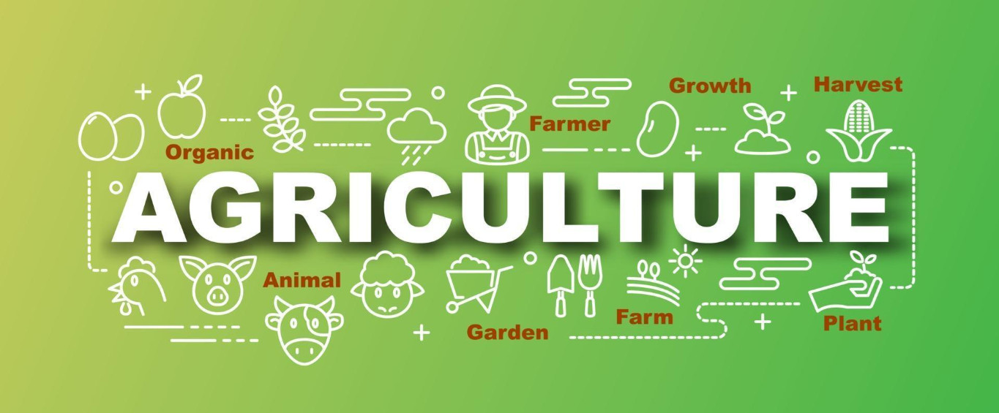

<!-- Banner (opcional) -->
<p align="center">
  
</p>

<h1 align="center">🌱 Proyecto Agrícola — Calidad y Visualización de Datos</h1>
<p align="center">
  <i>EDA, control de calidad y visualización de un dataset agrícola.</i>
</p>

<p align="center">
  <!-- Badges -->
  <a href="https://www.python.org/"></a>
  <a href="#"></a>
  <a href="#"></a>
  <a href="LICENSE"></a>
  
  
</p>

<p align="center">
  <a href="#-demo-rápida">Demo</a> ·
  <a href="#-características">Características</a> ·
  <a href="#-estructura-del-proyecto">Estructura</a> ·
  <a href="#-instalación">Instalación</a> ·
  <a href="#-uso">Uso</a> ·
  <a href="#-resultados">Resultados</a> ·
  <a href="#-metodología">Metodología</a> ·
  <a href="#-preguntas-frecuentes">FAQ</a>
</p>

---

## 🚀 Demo rápida

> Ejecuta el análisis y guarda los gráficos automáticamente en `outputs/`:

```bash
python -m venv .venv
.\.venv\Scripts\activate              # macOS/Linux: source .venv/bin/activate
pip install -r requirements.txt
python main.py


